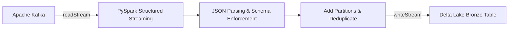

# Hi, I'm Sasidhar Mopuru

Data Engineer building scalable streaming pipelines and lakehouse systems.

## About Me

I specialize in end-to-end data engineering with a focus on:

- Event streaming with **Apache Kafka**
- Distributed processing with **Apache Spark / PySpark**
- Lakehouse architectures with **Delta Lake** and **Databricks**
- Reliable, testable pipelines with **CI/CD**

## Tech Stack

## Featured Project: Kafka -> PySpark -> Delta Lake

A production-style streaming pipeline demonstrating **Kafka ingestion**,
**PySpark Structured Streaming** transformations, and **Delta Lake** storage on
Databricks.

- Repository: [Sasireddy001/Kafka-pyspark-delta-pipeline](https://github.com/Sasireddy001/Kafka-pyspark-delta-pipeline)
- Includes automated **pytest** tests, **GitHub Actions** CI, a sample data
generator, and a performance benchmark.

## GitHub Stats

## Connect

- Email: sasidharmopuru@gmail.com
- GitHub: [@Sasireddy001](https://github.com/Sasireddy001)
